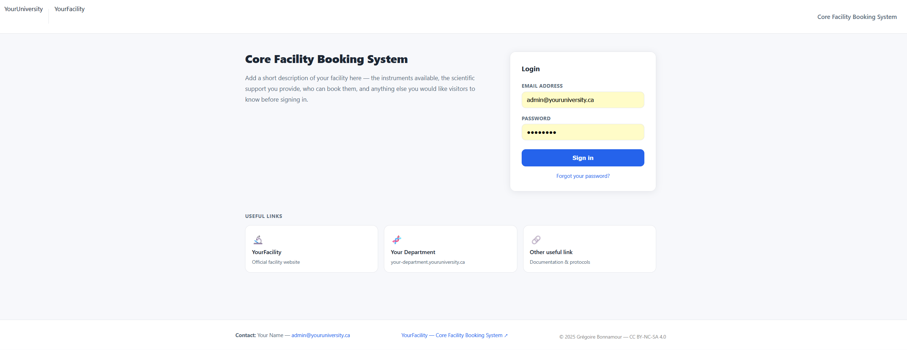
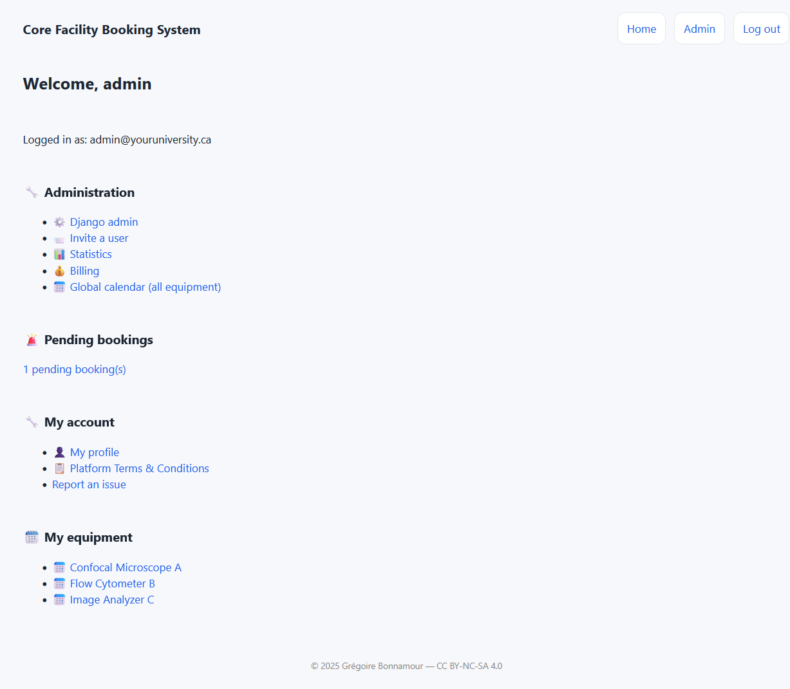
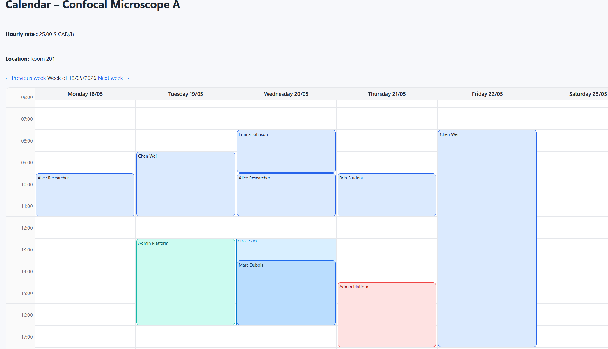
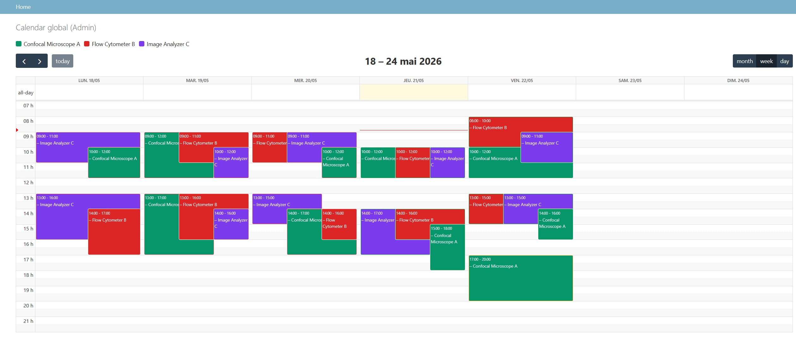
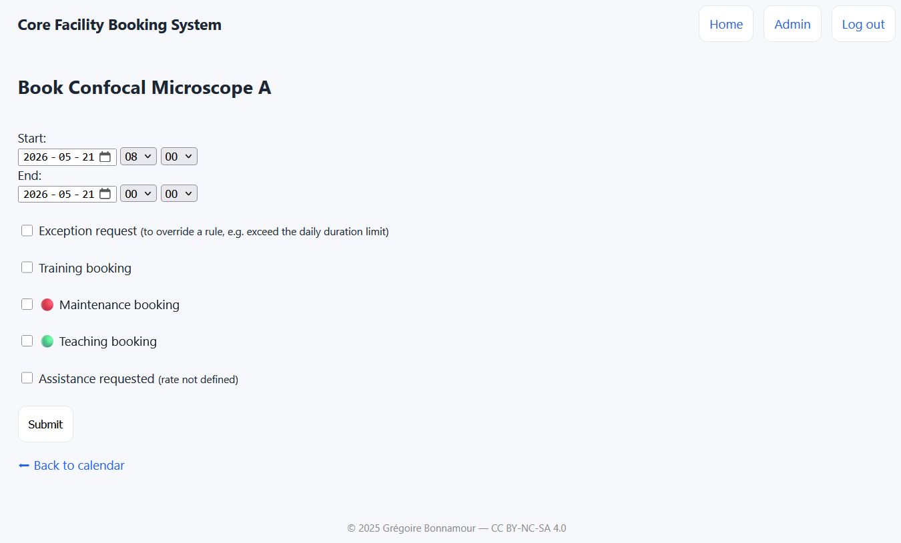
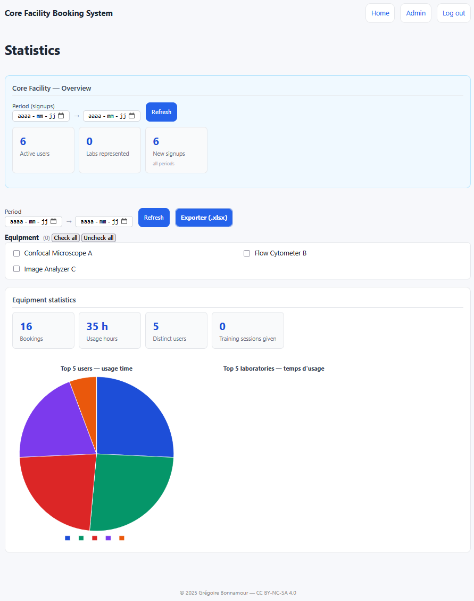
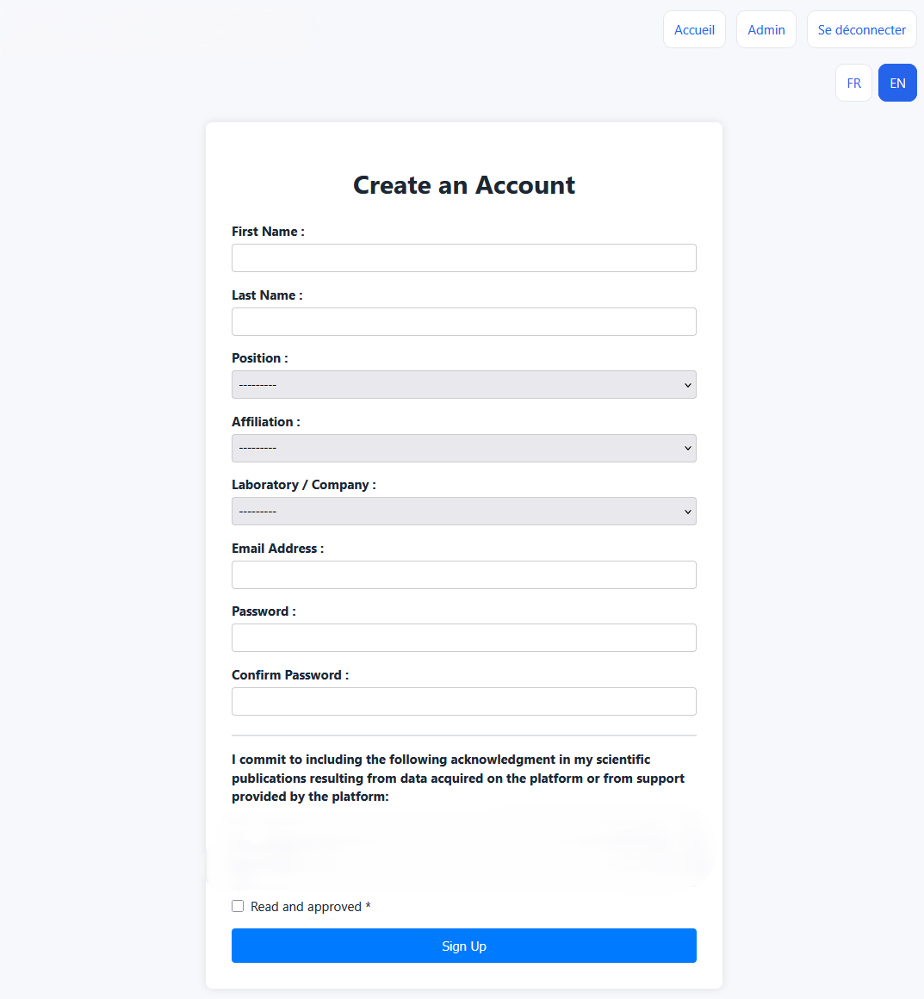
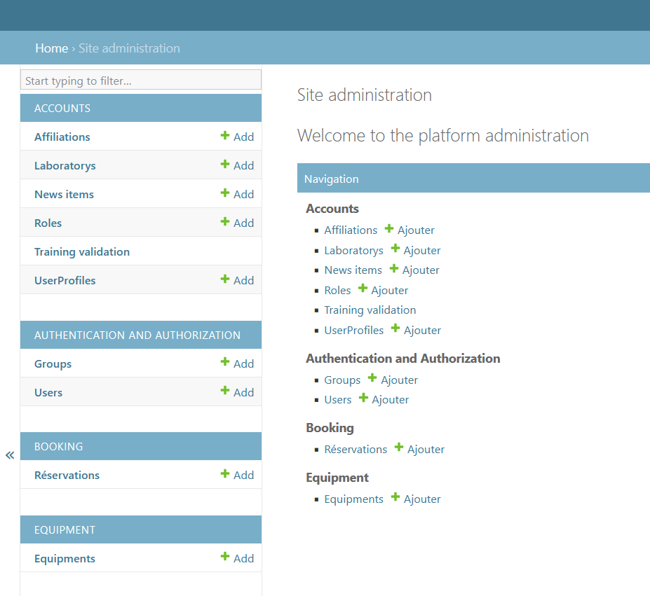

# Core Facility Booking System

A Django-based equipment booking and management system for research core facilities.

## Features

- Equipment reservation calendar with weekly view per instrument
- User management: invitation-based registration, access control per equipment
- Billing and usage tracking (PDF invoices via WeasyPrint, Excel export)
- Admin dashboard with reservation statistics
- Fully English interface
- Maintenance scheduling and usage reporting
- Assistance request notifications with iCalendar (.ics) attachment for one-click calendar import
- News feed for facility announcements

## Screenshots

### Login page


### Dashboard


### Equipment calendar


### Global calendar


### Booking form


### Statistics


### Registration


### Admin panel


## Tech Stack

| Component | Version |
|---|---|
| Python | 3.12 |
| Django | 4.2.x (LTS) |
| Gunicorn | 23.x |
| Nginx | 1.24 (reverse proxy) |
| Database | SQLite 3.45 (PostgreSQL-ready via psycopg2) |
| WeasyPrint | 66.x (PDF generation) |
| openpyxl | 3.1.x (Excel export) |
| python-dotenv | 1.x (environment config) |
| icalendar | 5.x+ (iCalendar .ics generation) |

## Installation

```bash
# 1. Clone
git clone https://github.com/your-org/core-facility-booking.git
cd core-facility-booking

# 2. Virtual environment
python3 -m venv .venv
source .venv/bin/activate

# 3. Dependencies
pip install -r requirements.txt

# 4. Environment config
cp .env.example .env.local
# Edit .env.local: set SECRET_KEY, ALLOWED_HOSTS, email settings

# 5. Database
python manage.py migrate --settings=systeme_reservation_plateforme.settings.local

# 6. Load demo data (optional)
python manage.py loaddata fixtures/demo_data.json \
    --settings=systeme_reservation_plateforme.settings.local

# 7. Create superuser (if not using demo fixtures)
python manage.py createsuperuser \
    --settings=systeme_reservation_plateforme.settings.local

# 8. Run development server
python manage.py runserver \
    --settings=systeme_reservation_plateforme.settings.local
```

### Nginx (production)

Point an Nginx `location /` block to Gunicorn on `127.0.0.1:8001`.  
See `DEPLOY.md` for a complete production setup guide.

## Demo Data

The file `fixtures/demo_data.json` provides a ready-to-use dataset:

| Account | Email | Password | Role |
|---|---|---|---|
| Admin | `admin@youruniversity.ca` | `AdminDemo2026!` | Superuser + admin |
| Alice Researcher | `user1@youruniversity.ca` | `UserDemo2026!` | Standard user |
| Bob Student | `user2@youruniversity.ca` | `UserDemo2026!` | Standard user |

Includes 3 instruments (Confocal Microscope A, Flow Cytometer B, Image Analyzer C) and 6 reservations spread over the last 30 days.

Load with:
```bash
python manage.py loaddata fixtures/demo_data.json \
    --settings=systeme_reservation_plateforme.settings.local
```

## License

© Grégoire Bonnamour — CC BY-NC-SA 4.0  
https://creativecommons.org/licenses/by-nc-sa/4.0/
